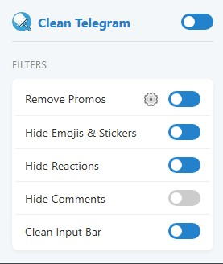

# Clean Telegram Web

A lightweight Chrome extension designed to declutter your Telegram Web experience.

  

## Features

- **Granular Control**: Toggle individual cleaning features on or off.
- **Customizable Promo Filter**: Remove unwanted promotional phrases from messages. Includes a customizable list with defaults for popular Hebrew channels.
- **Hide Distractions**: 
  - Hide Emojis & Stickers from message text and UI.
  - Hide Reactions (emoji counters) under messages.
  - Hide "Comment" and "Discuss" buttons in channels.
- **Clean Input Bar**: Hide the emoji/sticker picker and prevent browser auto-translation interference.
- **Privacy Focused**: No data collection; settings are stored locally in your browser.

## Installation

### From Source
1. Download or clone this repository.
2. Open Chrome and navigate to `chrome://extensions/`.
3. Enable **Developer mode** in the top right corner.
4. Click **Load unpacked** and select the folder containing this extension.

## Usage

1. Open [Telegram Web](https://web.telegram.org/).
2. Click the Clean Telegram icon in your extension bar.
3. Use the main switch to enable/disable all cleaning.
4. Use the individual toggles to customize your experience.
5. Click the **gear icon (⚙️)** next to "Remove Promos" to edit the list of phrases you want to hide.

## Privacy

This extension does not track you or send any data to external servers. All settings and custom filters are stored locally using `chrome.storage.local`.